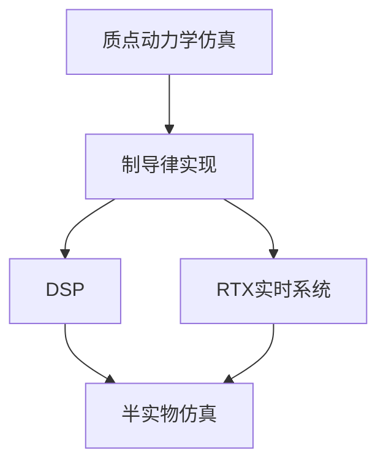
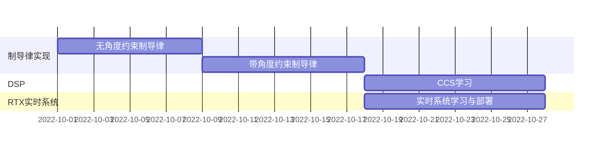

# BUAASchoolOfAstronauticsGuidanceLaw

这是为了导弹制导律科研课堂准备的仓库

定期更新代码和文档

##### 参与人员

郜是瞻 李恕鼎 逯路通 张一帆

##### 项目结构

``` mermaid
graph TB
质点动力学仿真 --> 制导律实现 --> DSP
制导律实现 -->RTX实时系统
DSP --> 半实物仿真
RTX实时系统 --> 半实物仿真
```

##### 项目进度：制导律实现

```mermaid
gantt
dateFormat YYYY-MM-DD
section 制导律实现
无角度约束制导律: 2022-10-01, 8d
带角度约束制导律: 2022-10-09,9d
section DSP
CCS学习: 2022-10-18,10d
section RTX实时系统
实时系统学习与部署:2022-10-18,10d
```

文档进度：暂无

day 10.18
