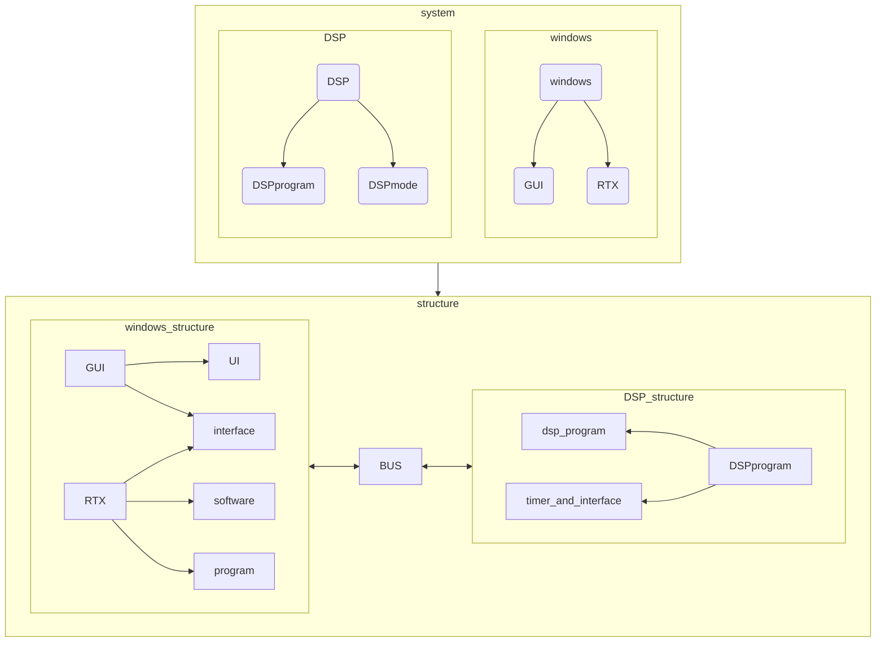

```mermaid
flowchart TB


    subgraph system
        direction TB
        
    subgraph windows 
        direction TB
    id1(windows)
    id2(GUI)
    id3(RTX)
        id1-->id2
        id1-->id3

    end

    subgraph DSP 
        direction TB
    id4(DSP)
    id6(DSPprogram)
    id7(DSPmode)
        id4-->id6
        id4-->id7
    end

    end
subgraph structure
    subgraph windows_structure
    	direction LR
    	GUI-->UI    	
    	GUI-->interface
		RTX-->software
		RTX-->program
		RTX-->interface
		
    	
    end

	subgraph DSP_structure
	direction RL
	DSPprogram-->dsp_program
	DSPprogram-->timer_and_interface
	end
windows_structure<-->BUS<-->DSP_structure
end
system-->structure
```

